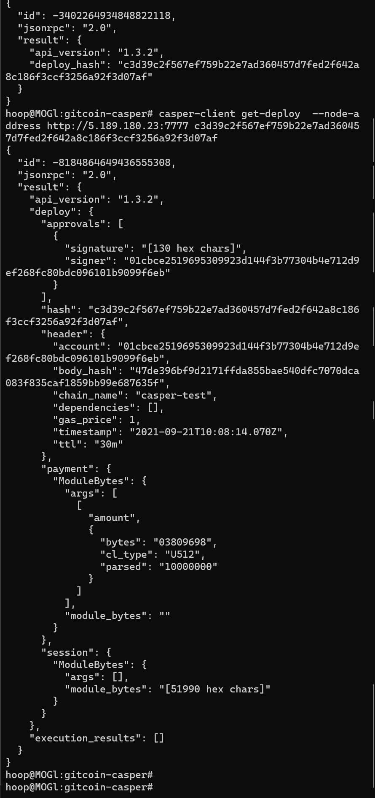
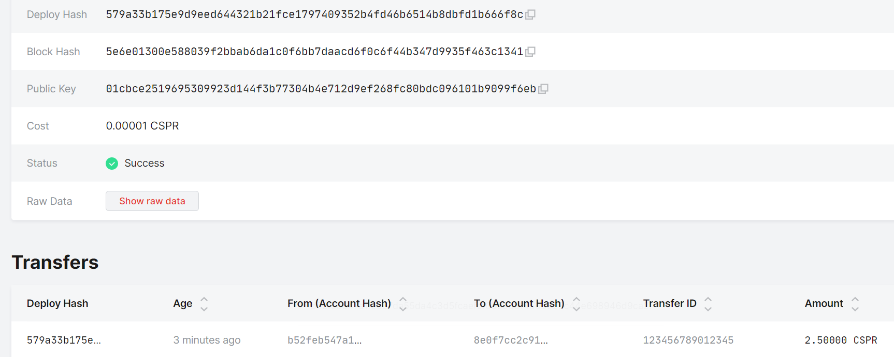
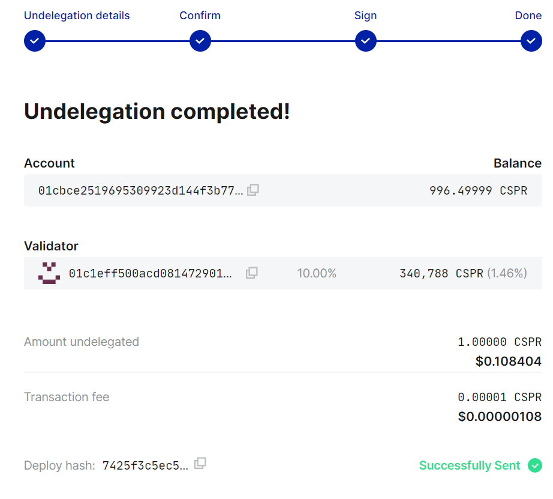

# Get Started With Casper (First 100 Submissions)


## 1. Create and deploy a simple, smart contract with cargo casper and cargo test


### Cargo Test


### Create and deploy a simple, smart contract





## 2. Complete one of the existing tutorials for writing smart contracts
ERC-20 Tutorial

1.Prepare environment.

2.Compile contract and run the contract unit tests.


## 3. Demonstrate key management concepts by modifying the client in the Multi-Sig tutorial to address one of the additional scenarios

Scenario 3: 


```

const keyManager = require('./key-manager');
const TRANSFER_AMOUNT = process.env.TRANSFER_AMOUNT || 2500000000;

(async function () {
    
    // In this example the 2 additional accounts will be added to 
    // the mainAccount to perform deploys, but they will not be 
    // able to add another account. 
    
    // To achive the task, we will:
    // 1. Set mainAccount's weight to 1.
    // 2. Set Deploy Threshold to 1.    
    // 3. Add first new key with weight 1 (first account).
    // 4. Set Keys Management Threshold to 2.

    let deploy;

    // 0. Initial state of the account.
    // There should be only one associated key (facuet) with weight 1.
    // Deployment Threshold should be set to 1.
    // Key Management Threshold should be set to 1.
    let masterKey = keyManager.randomMasterKey();
    let mainAccount = masterKey.deriveIndex(1);
    let firstAccount = masterKey.deriveIndex(2);

    console.log("\n0.1 Fund main account.\n");
    await keyManager.fundAccount(mainAccount);
    await keyManager.printAccount(mainAccount);
    
    console.log("\n[x]0.2 Install Keys Manager contract");
    deploy = keyManager.keys.buildContractInstallDeploy(mainAccount);
    await keyManager.sendDeploy(deploy, [mainAccount]);
    await keyManager.printAccount(mainAccount);

    // 1. Set mainAccount's weight to 1
    console.log("\n1. Set faucet's weight to 1\n");
    deploy = keyManager.keys.setKeyWeightDeploy(mainAccount, mainAccount, 1);
    await keyManager.sendDeploy(deploy, [mainAccount]);
    await keyManager.printAccount(mainAccount);
    

    
    // 2. Set Deploy Threshold to 1.
    console.log("\n3. Set Deploy Threshold to 1.\n");
    deploy = keyManager.keys.setDeploymentThresholdDeploy(mainAccount, 1);
    await keyManager.sendDeploy(deploy, [mainAccount]);
    await keyManager.printAccount(mainAccount);
    
    // 3. Add first new key with weight 1 (first account).
    console.log("\n4. Add first new key with weight 1.\n");
    deploy = keyManager.keys.setKeyWeightDeploy(mainAccount, firstAccount, 1);
    await keyManager.sendDeploy(deploy, [mainAccount]);
    await keyManager.printAccount(mainAccount);

    // 4. Set Keys Management Threshold to 2.
    console.log("\n2. Set Keys Management Threshold to 2\n");
    deploy = keyManager.keys.setKeyManagementThresholdDeploy(mainAccount, 2);
    await keyManager.sendDeploy(deploy, [mainAccount]);
    await keyManager.printAccount(mainAccount);
    
 
})();


```

### Final result:


## 4. Learn to transfer tokens to an account on the Casper Testnet. Check out this documentation.
### Screnshot of transfering tokens and deployment status:





## 5.Learn to Delegate and Undelegate on the Casper Testnet. Check out these instructions.



